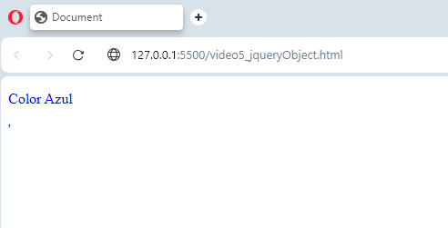

# YOUT-CursoJQuery
https://www.youtube.com/watch?v=3nbsVZFLJgk&list=PL_wRgp7nihyY020gyukDupJEJ84gimiPS&index=6

## Video 3
```html
<body>
    <script src="/js/lib/jquery-3.7.1.min.js"></script>

    <p id="parrafo">Texto</p>

    <script>
        //                  //Ambos son iguales.
        // $(document).ready(function(){
        //     $('#parrafo').text("Hola Mundo");
        // });

        $(function(){
            $('#parrafo').text("Hola Mundo2");
        })
    </script>
</body>
```

## Video 4
```html
<body>
    <script src="/js/lib/jquery-3.7.1.min.js"></script>

    <p id="parrafo">Texto</p>

    <script>
        //                  //Con esto desabilitamos el uso del signo dolar, esto ya que puede haber otras librerias
        //                  //  que tambien utilizen el simbolo, por lo tanto con esto omitimos el uso del signo dolar
        //                  //  para el uso en JQUERY.
        //                  //Y Ahora para utilizar JQUERY se haria de la siguiente forma
        
        //  //              //Forma 1
        // jQuery.noConflict();
        // jQuery(function(){
        //     jQuery('#parrafo').text("Hola Mundo2 7358");
        // })

        //  //              //Forma 2. A traves de la encapsulacion
        // jQuery(function ($){
        //     jQuery('#parrafo').text("Hola Mundo2 73582");
        // });

        //                  //Forma 3.
        var jqueryAntiguo = jQuery.noConflict();
        jqueryAntiguo('#parrafo').text("Hola Mundo2 77");
    </script>

    <!--                    El siguiente es un caso muy Raro, pero es para casos donde se quierar utilizar 2 versiones 
                                de JQuery en un mismo proyecto-->
                                
    <!-- <script src="/js/lib/jquery-2.1.1.min.js"></script>
    <script>
        var jqueryAntiguo = jQuery.noConflict();
    </script>

    <script src="/js/lib/jquery-3.7.1.min.js"></script>
    <script>
        var jqueryNuevo = jQuery.noConflict();
    </script> -->
</body>
```

## Video 5

```html
<body>
    <script src="/js/lib/jquery-3.7.1.min.js"></script>

    <div id="miCapa"></div>

    <script>
        var selectorCapa = $('#miCapa');

        //                  //html mas utilizado para meter tags dentro de un contenedor, como Div en este caso.
        selectorCapa.html("<p style='color:blue';> Color Azul </p>'");


        console.log(selectorCapa);

        var miCapa = selectorCapa[0];
        
        console.log(miCapa);
    </script>

</body>
```

